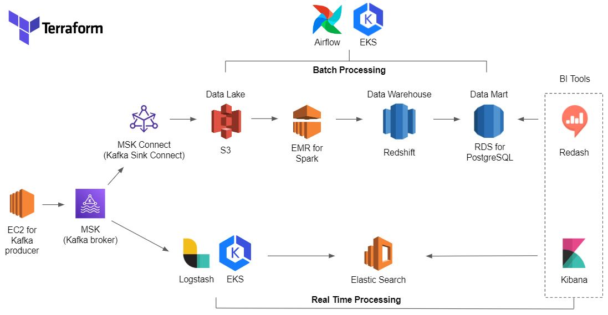
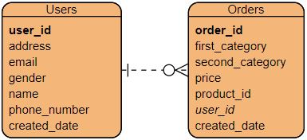
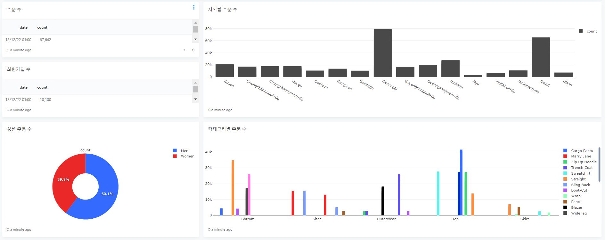
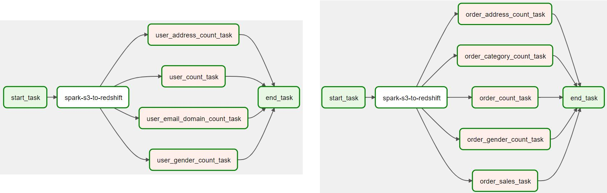
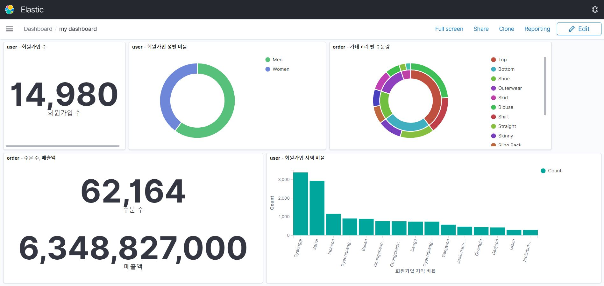

# 데이터 파이프라인 만들기 (AWS, Terraform)

<br/><br/>


# 데이터 파이프라인 구조



<br/><br/>


# 기술 스택
* Cloud service : AWS
* IaC : Terraform
* Message Broker : MSK(AWS Kafka)
    * Kafka S3 Sink Connector
* Batch Pipeline
    * Data Lake : S3
    * Batch Processing : Spark on EMR
    * Data Warehouse : Redshift
    * Data Mart : PostgreSQL on RDS
    * BI Tool : Redash
* Real Time Pipeline
    * Kafka Consumer : Logstash on EKS
    * Database : Elastic Search on AWS
    * BI Tool : Kibana
* Workflow Manager : Airflow on EKS (Helm Chart)

<br/><br/>


# 프로젝트 설명

* 시뮬레이션 데이터가 Python으로 구현된 Kafka Producer를 통해 Kafka broker로 전송된다. 
    * User(회원) 데이터와 Order(주문) 데이터가 계속 카프카에 전송되는 상황을 가정
    * User 데이터의 gender, address와 Order 데이터의 category 등은 랜덤하게 생성이 되지만 특정 비율을 가진다.
        * 예를 들면 생성되는 User 데이터의 gender 비율은 남녀가 6대4다.
        * 이렇게 랜덤하게 생성되는 비율을 각각의 파이프라인 끝에서 BI Tool로 직접 확인할 수 있다.
    * 아래는 시뮬레이션 데이터의 ERD  
        
<br/><br/>

* kafka에 적재되는 데이터를 Batch Pipeline과 Real time Pipeline으로 각각 처리한다.
* Batch Pipeline
    * Kafka s3 sink connector가 브로커를 컨슈밍하여  S3(Data Lake)로 적재되면 S3에 시간 단위로 쌓이면 여기서 파이프라인이 시작된다.
    * EMR 클러스터에서 Spark가 실행되고 S3에서 데이터를 가져와 processing하여 Redshift(Date Warehouse)에 전송한다.
    * Redshift에 적재된 데이터를 집계하여 PostgreSQL(RDS)로 전송한다.
        * BI Tool에서 Redshift에 직접 접근해서 집계해도 되지만, 시뮬레이션 데이터가 아닌 빅데이터를 가정했을 때 대화형으로 집계를 하려하면 지연이 있을 것이라 생각하여 미리 집계를 하고 집계된 데이터를 재활용한다.
    * Redash를 통해 특정 기간을 선택하면 회원가입 수, 성별 회원가입 수, 주문 수, 카테고리별 주문 수 등을 대시보드에서 확인할 수 있다.
    
<br/><br/>

    * 위 과정은 User 데이터와 Order 데이터에 대하여 각각 실행된다.
    * 이 모든 workflow는 Airflow를 통해 스케줄링된다. Airflow는 EKS에서 Helm Chart로 배포된다. 아래는 User dag와 Order dag다.
    
<br/><br/>

* Real time Pipeline
    * ELK 스택을 사용한다.
    * Logstash는 EKS 위에서 실행된다. 안정성을 높이고 처리해야 할 데이터가 많아질 시 최대 Kafka partition 수까지 유동적으로 container 수를 조절하여 병렬처리를 가능하게 한다.
    * Elasticsearch에 적재된 데이터를 Kibana dashboard를 통해 실시간으로 확인할 수 있다.
    

<br/><br/>


# 폴더 구조

* terraform/ : 테라폼 코드
    * modules/ : 각 리소스들의 모듈 폴더들이 있다.
    * msk/ : msk 관련 리소스 구현 코드
    * msk-connect/ : msk connect 관련 리소스 구현 코드
    * batch-pipeline/ : batch pipeline 관련 리소스 구현 코드
    * elk : elk 관련 리소스 구현 코드
* kafka/
    * producer/ : 시뮬레이션 데이터 생성, kafka producer 코드
    * scripts/ : 토픽 생성, 콘솔 컨슈머 실행, 프로듀서 실행 스크립트
* spark/ : user, order 데이터 처리 코드
* db / : redshift, postgresql 테이블 생성 코드
* airflow/
    * dags/ : airflow dag 코드
    * helm/ : helm 설정 파일
* redash/ : redash 대시보드 만들 때 사용하는 기본 sql format
* elk/logstash/ : logstash k8s object들 설정파일 (configmap, deployment)
* imgs/ : README 파일 작성에 사용되는 이미지

<br/><br/>


# 파이프라인 실행

## 사전 환경
* aws cli, terraform, kubectl, helm 등 프로젝트에 사용되는 패키지들이 설치된 환경이 필요하다.
* 나의 경우 저사양 ec2를 사용했다.
<br/><br/>

## MSK 관련 리소스들 생성
```bash
cd terraform/msk
terrafrom init
terraform apply
cd ../..
```
<br/><br/>

## Kafka Topic 생성
* User 토픽과 Order 토픽이 생성된다.
* 이름이 producer-ec2인 인스턴스에 접속하여 해당 해당 레포지토리를 클론하고 아래 명령어를 입력한다.
* kafka는 ec2가 생성될 때 자동으로 설치되게 했으므로 따로 설치할 필요가 없다.
```bash
bash scripts/create-topics.sh ${BOOTSTRAPSERVER}
```
<br/><br/>

## Console에서 Kafka Consumer 실행 (테스트용)
```bash
bash scripts/run-console-consumer.sh ${BOOTSTRAPSERVER} ${TOPIC_NAME}
```
<br/><br/>

## Kafka Producer 실행
* 스크립트에 들어가는 파라미터는 kafka/producer/ 폴더 내의 코드를 확인하면 알 수 있다.
```bash
pip3 install faker
pip3 install kafka-python
bash scripts/run-producer.sh ${BOOTSTRAP_SERVER} \
                            ${INIT_USER_COUNT} \
                            ${USER_COUNT_IN_LOOP} \
                            ${RATIO_ORDER_USER} \
                            ${INTER_MESSAGE_SECOND} \
                            ${INTER_ITER_SECOND}
```
<br/><br/>

## ELK 관련 리소스들 생성
```bash
cd terraform/elk
terrafrom init
terraform apply
cd ../..
```
<br/><br/>

## Kibana 서버 접속
* public access가 불가능하므로 elk vpc에 bastion ec2를 통해 ssl tunneling으로 접속
* 아래 내용을 host pc의 ssh config를 입력한다.
```
Host es
HostName ${elk_bastion_ip}
User ec2-user
IdentitiesOnly yes
IdentityFile ${key_file_path}
LocalForward 9200 ${aws_es_domain_host}
```

* host에서 아래 명령어를 입력하고 localhost:9200/_plugin/kibana에 접속한다.
```bash
ssh es -N
```
<br/><br/>

## EKS 클러스터에 Logstash 실행
* 먼저 elk/logstash/configmap.yml 파일에서 bootstrap_servers 설정을 모두 현재 broker bootstrap server 값으로 바꿔준다.

```bash
# eks 클러스터 접속 설정
aws eks --region ap-northeast-2 update-kubeconfig --name logstash-eks

cd elk/logstash

# 현재 경로의 모든 yml 파일을 읽고 object들 실행
kubectl apply -f .

# 띄워진 pods 확인
kubectl get pods

# 위 명령어로 확인한 pod Name을 이용해 해당 파드에 접속하여 로그 확인
kubectl logs -f ${pod_name}

cd ../../
```
<br/><br/>


## Kafka Connect 관련 리소스들 생성
* https://www.confluent.io/hub/confluentinc/kafka-connect-s3 링크에 들어가서 confluentinc-kafka-connect-s3-10.3.0.zip  파일을 다운받는다. 이 파일은 kafka s3 sink connector plugin이다.
* 이 파일을 terraform/msk-connect/ 폴더에 넣고 아래 명령어를 입력한다.

```bash
cd terraform/msk-connect
terrafrom init
terraform apply
cd ../..
```
<br/><br/>


## Batch pipeline 관련 리소스들 생성
* EMR, Redshift, PostgreSql, EKS(Airflow), Redash EC2가 생성된다.
```bash
cd terraform/emr
terrafrom init
terraform apply
cd ../..
```
<br/><br/>


## EMR 클러스터 접속 후 Spark 실행 (테스트용)
```bash
ssh -i ${keyfile_path} hadoop@${master_node_ip}

spark-submit \
  --jars /usr/share/aws/redshift/jdbc/RedshiftJDBC.jar,/usr/share/aws/redshift/spark-redshift/lib/spark-redshift.jar,/usr/share/aws/redshift/spark-redshift/lib/spark-avro.jar,/usr/share/aws/redshift/spark-redshift/lib/minimal-json.jar \
  ${python_file}
```
<br/><br/>


## Redshift, PostgreSQL에 필요한 테이블 생성
```bash
cd db/
python3 init_redshift.py
python3 init_postgresql.py
```
<br/><br/>


## EKS 클러스터에 Airflow Helm Chart 배포
* Airflow 스케줄링을 하려면 먼저 hadoop master 클러스터에 접속하여 해당 레포지토리를 클론해야한다.
* 포트포워딩 명령어를 입력 후 명령어를 실행한 instance의 ip의 8080포트로 접속하면 Airflow webserver로 접속할 수 있다.
```bash
# Airflow EKS 클러스터 접속
aws eks --region ap-northeast-2 update-kubeconfig --name airflow-eks

cd airflow/helm/

helm upgrade --install airflow apache-airflow/airflow \
-n airflow -f custom-values.yaml --create-namespace

# 포트포워딩 설정
kubectl port-forward svc/airflow-webserver 8080:8080 --address=0.0.0.0 --namespace airflow
```
<br/><br/>


## Airflow ssh 접속 설정
* Airflow webserver에 접속하여 EMR 클러스터에 대한 SSH 설정을 해준다.
* 그리고 Airflow webserver 메인 페이지에서 DAG 토글을 on으로 바꿔주면 스케쥴링이 시작된다.
